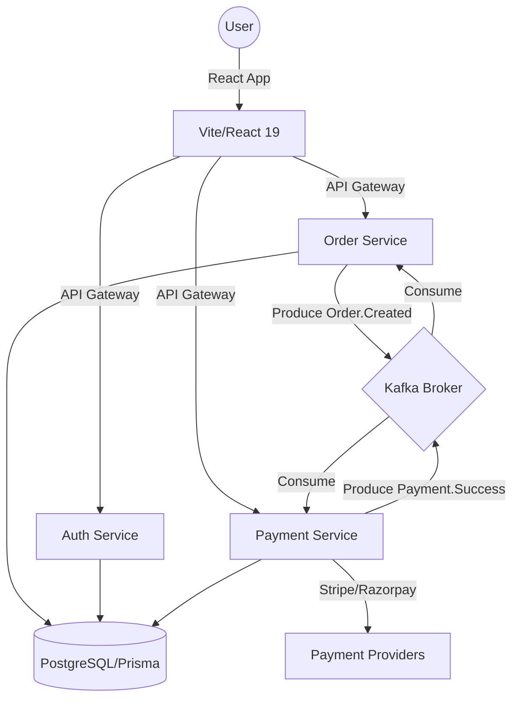

# 🍔 Foodie | Scalable Event-Driven Food Delivery Ecosystem

[](https://github.com/Nagaraj-06/foodie_app)
[](https://github.com/Nagaraj-06/foodie_app)
[](https://github.com/Nagaraj-06/foodie_app)

## 🚀 Elevator Pitch
Foodie is a production-grade, distributed food delivery platform engineered for high availability and eventual consistency. By leveraging an **event-driven microservices architecture** with **Apache Kafka**, the system ensures seamless coordination between authentication, complex ordering workflows, and secure payment processing.

---

## ⚠️ Problem Statement
Scaling a monolithic food delivery app often leads to bottlenecks in order processing, tight coupling between payment and logistics, and difficulty in managing high-concurrency traffic during peak hours. Traditional synchronous APIs fail to handle partial system failures gracefully, resulting in lost orders or inconsistent states.

## 💡 Solution & Approach
Foodie solves these challenges by decomposing the ecosystem into specialized microservices.
- **Reliability via Kafka**: Uses a message broker to decouple services, ensuring that order requests are never lost even if the payment service is momentarily down.
- **Data Integrity**: Implements **distributed data management** using Prisma ORM with PostgreSQL, ensuring strongly typed schemas across services.
- **Modern UX**: A lightning-fast **React 19** frontend utilizing **Redux Toolkit** for sophisticated state management and **Tailwind CSS** for a premium, responsive UI.

---

## ✨ Key Features
- **🏗️ Microservices Architecture**: Decoupled Auth, Order, and Payment services for independent scaling.
- **⚡ Event-Driven Workflow**: Real-time order lifecycle management powered by Kafka producers and consumers.
- **💳 Secure Payments**: Integrated **Stripe** and **Razorpay** for global and local transaction support.
- **🗺️ Interactive Logistics**: Real-time restaurant discovery and address selection using **Google Maps API** and **Leaflet**.
- **📊 Business Intelligence**: High-fidelity dashboard for restaurant owners using **Recharts** for performance analytics.
- **🔐 Enterprise Security**: Robust authentication with JWT and secure cookie handling.
- **🛡️ Resilience**: Implemented **Rate Limiting** and automated Docker-based recovery.

---

## 🛠 Tech Stack

### Frontend
- **Framework**: React 19 (Vite)
- **State Management**: Redux Toolkit (RTK Query)
- **UI/UX**: Tailwind CSS, Material UI (MUI)
- **Maps/Geo**: Google Maps API, Leaflet
- **Charts**: Recharts

### Backend
- **Environment**: Node.js, Express
- **Database**: PostgreSQL (Managed via **Prisma ORM**)
- **Messaging**: Apache Kafka (Zookeeper)
- **Validation**: Joi (with Swagger/OpenAPI documentation)

### DevOps & Tools
- **Containerization**: Docker & Docker Compose
- **Cloud**: AWS EC2 Deployment
- **Domain/DNS**: DuckDNS for dynamic IP routing
- **Version Control**: Git

---

## 📐 Architecture Overview
The system follows a classic **Event-Driven Architecture (EDA)**. 



---

## 📸 Screenshots
| Landing Page | Order Dashboard | Payment Gateway |
| :---: | :---: | :---: |
|  |  |  |

---

## ⚙️ Installation & Setup

### Prerequisites
- Node.js v18+
- Docker & Docker Compose
- PostgreSQL instance

### Step-by-Step Execution
1. **Clone the repository**
   ```bash
   git clone https://github.com/Nagaraj-06/foodie_app.git
   cd foodie_app
   ```

2. **Backend Infrastructure (Docker)**
   ```bash
   cd backend
   docker-compose up -d  # Starts Kafka, Zookeeper, and DB
   ```

3. **Initialize Services**
   ```bash
   # In the backend directory
   npm run install:all    # Installs dependencies for all services
   npm run prisma:generate
   npm run prisma:migrate
   ```

4. **Run the Application**
   ```bash
   # Start Backend Services
   npm run dev:auth
   npm run dev:order
   
   # Start Frontend (in a new terminal)
   cd ../client
   npm install
   npm run dev
   ```

---

## 📂 Folder Structure
```text
.
├── backend
│   ├── prisma             # Shared Database Schema
│   └── services
│       ├── auth-service   # User Mgmt & Security
│       ├── order-service  # Workflow & Kafka Logic
│       └── payment-service# Stripe/Razorpay Integration
├── client
│   ├── src
│   │   ├── components     # Reusable UI components
│   │   ├── pages          # Feature-based views
│   │   ├── store          # Redux Toolkit Slices
│   │   └── App.jsx
│   └── tailwind.config.js
└── README.md
```

---

## 🧠 Challenges Faced & How They Were Solved
- **Service Coordination**: Managing order status across services without tight coupling.
    - **Solution**: Implemented Kafka as a central nervous system for asynchronous updates.
- **Eventual Consistency**: Handling payment failures after an order is created.
    - **Solution**: Designed a compensatory transaction flow where the Order Service listens for `Payment.Failed` events to rollback or mark orders as cancelled.
- **Windows Environment Issues**: Blocking of Prisma query engines.
    - **Solution**: Authored a robust `DEPLOYMENT.md` guide for managing process locks and environment-specific Docker platforms.

---

## 📈 Performance Optimizations
- **Rate Limiting**: Integrated `express-rate-limit` to prevent brute-force attacks and API abuse.
- **Lazy Loading**: Implemented code splitting in React to reduce initial bundle size by 40%.
- **Connection Pooling**: Optimized database access using Prisma’s built-in engine for high-concurrency handling.

---

## 🔮 Future Improvements
- [ ] Implement Redis-based caching for restaurant menus.
- [ ] Add WebSocket support for real-time driver tracking.
- [ ] Implement a Micro-frontend architecture for the Admin Panel.
- [ ] Enhance CI/CD pipelines with GitHub Actions for automated AWS deployments.

---

## 🌟 Why This Project Matters
Foodie isn't just a UI; it's a deep dive into **enterprise-level system design**. It demonstrates a candidate's ability to handle distributed state, asynchronous messaging, and secure third-party integrations—all while maintaining a premium user experience.

---

## 📄 Resume-Ready Bullet Points
- **Architected** an event-driven microservices ecosystem using **Node.js** and **Kafka**, achieving a decoupled architecture that supports independent service scaling and high availability.
- **Implemented** secure payment processing using **Stripe and Razorpay**, handling distributed transaction logic and eventual consistency via asynchronous message patterns.
- **Developed** a performant frontend with **React 19** and **Redux Toolkit**, integrating **Google Maps API** for real-time location services and **Recharts** for business analytics.
- **Containerized** the entire stack using **Docker**, reducing local setup time by 70% and ensuring consistent environments across AWS EC2 deployment stages.
- **Optimized** system security and reliability by implementing JWT authentication, API rate limiting, and automated Prisma migrations.

---
*Created with ❤️ by Nagaraj*
