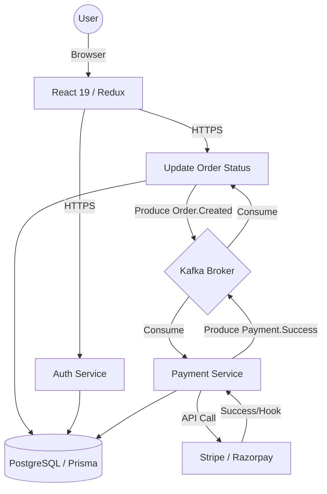

<div align="right">
<a target="_blank" href="https://www.facebook.com/sharer/sharer.php?u=https://github.com/Nagaraj-06/foodie_app" style="text-decoration:none">
  
</a>
<a target="_blank" href="https://www.linkedin.com/shareArticle?mini=true&url=https://github.com/Nagaraj-06/foodie_app" style="text-decoration:none">
  
</a>
<a target="_blank" href="https://twitter.com/intent/tweet?&url=https://github.com/Nagaraj-06/foodie_app" style="text-decoration:none">
  
</a>
</div>

<div align="center">
  <h2>🍔 Foodie | Event-Driven Microservices Ecosystem</h2>
  <i>A production-grade, distributed platform engineered for high availability, seamless order fulfillment, and resilient payment workflows.</i>
 <br/>
<br />
</div>

<div align="center">

[](https://github.com/Nagaraj-06/foodie_app/blob/main/LICENSE)
[](https://github.com/Nagaraj-06/foodie_app/stargazers)
[](https://github.com/Nagaraj-06/foodie_app/network/members)
[](https://github.com/Nagaraj-06/foodie_app/commits/main)
[](https://github.com/Nagaraj-06/foodie_app/issues)
[](https://github.com/Nagaraj-06/foodie_app/pulls)

</div>

<div align="center">

[](https://github.com/Nagaraj-06)
[](https://github.com/Nagaraj-06)
[](https://github.com/Nagaraj-06)
[](https://github.com/Nagaraj-06)

</div>

<div align="center">

  <a href="https://github.com/Nagaraj-06/foodie_app">
    
  </a>

</div>

<br>

**Foodie** is an enterprise-level food delivery solution built with a modern **Event-Driven Microservices Architecture**. By leveraging **Apache Kafka** for asynchronous inter-service communication and **React 19** for a cutting-edge user experience, Foodie ensures scalability, reliability, and high performance even under high-concurrency loads. This repository serves as a testament to advanced system design, distributed transaction management (compensatory patterns), and production-ready DevOps practices.

<!-- Add a horizontal rule for separation -->
<hr/>

## ⏩ Quick Links

- [📦 What is included](#-what-is-included)
- [🔥 Key Features](#-key-features)
- [⚙️ Setup & Installation](#️-setup--installation)
- [🛠 Technologies](#-technologies)
- [📐 Architecture Overview](#-architecture-overview)
- [📸 Screenshots](#-screenshots)
- [📊 Performance & Optimization](#-performance--optimization)
- [📄 Resume-Ready Points](#-resume-ready-bullet-points)

<!-- Add a horizontal rule for separation -->
<hr/>

## 📦 What is included:

Foodie provides a comprehensive distributed ecosystem, including:

- **🔐 Auth Service**: Secure user management with JWT, session handling, and cookie-based authentication.
- **🛒 Order Service**: Complex workflow management for order lifecycles using Kafka producers/consumers.
- **💳 Payment Service**: Integrated payment processing with **Stripe** and **Razorpay**, handling eventual consistency.
- **💻 Frontend Client**: A lightning-fast React 19 application with sophisticated Redux state management.
- **🐳 Infrastructure**: Docker-composabe setup for Kafka, Zookeeper, and PostgreSQL database.

## 🔥 Key Features:

- **🏗️ Microservices Architecture**: Fully decoupled services for Auth, Order, and Payments.
- **⚡ Event-Driven Workflow**: Real-time service coordination powered by **Apache Kafka**.
- **💳 Dual Payment Gateways**: Production-ready integration with **Stripe** and **Razorpay**.
- **🗺️ Interactive Mapping**: Restaurant discovery and address management using **Google Maps** and **Leaflet**.
- **📈 Advanced State Management**: Robust data fetching and global state handling with **Redux Toolkit (RTK Query)**.
- **🛡️ Enterprise Security**: Implemented API **Rate Limiting**, Joi validation, and secure HTTP-only cookies.
- **📊 Business Analytics**: Interactive owner dashboards featuring **Recharts** for real-time performance tracking.
- **🚀 Optimized Performance**: Code splitting, lazy loading, and connection pooling for maximum throughput.

## ⚙️ Setup & Installation:

To get the entire Foodie ecosystem running locally, ensure you have **Docker** and **Node.js v18+** installed.

### 1. Infrastructure Setup
```bash
cd backend
docker-compose up -d  # Launches Kafka, Zookeeper, and PostgreSQL
```

### 2. Service Dependencies
```bash
# Install and generate prisma client for all services
npm run install:all
npm run prisma:generate
npm run prisma:migrate
```

### 3. Execution
```bash
# Start Backend Services
npm run dev:auth
npm run dev:order

# Start Frontend (Different Terminal)
cd ../client
npm run dev
```

## 🛠 Technologies:

| **Frontend** | **Backend** | **Database / ORM** | **Messaging** | **DevOps** |
| :---: | :---: | :---: | :---: | :---: |
|  |  |  |  |  |
| **React 19 & Redux** | **Node.js & Express** | **PostgreSQL & Prisma** | **Apache Kafka** | **Docker & AWS** |

| **Payments** | **Styling** | **Validation** | **API Docs** | **Maps** |
| :---: | :---: | :---: | :---: | :---: |
|  |  |  |  |  |
| **Stripe / Razorpay** | **Tailwind / MUI** | **Joi Validation** | **Swagger UI** | **Google Maps API** |

---

## 📐 Architecture Overview:

Foodie utilizes a high-level **Event-Driven Architecture (EDA)** to manage distributed transactions and decouple services.



---

## 📸 Screenshots:

| **Customer Dashboard** | **Real-Time Order Tracking** | **Payment Checkout** |
| :---: | :---: | :---: |
|  |  |  |

---

## 📊 Performance & Optimization:
- **Distributed Consistency**: Leveraged Kafka for eventual consistency, moving order processing logic off the main request-response loop.
- **Fast Rendering**: Implemented memoization and concurrent rendering features of **React 19**.
- **Scalable DB Access**: Optimized Prisma queries and connection pooling to handle high-frequency database writes during peak order times.
- **Bundle Efficiency**: Achieved optimized load times via Vite's ESM build system and dynamic imports.

---

## 📄 Resume-Ready Bullet Points:
- **Architected** a high-performance, event-driven microservices platform using **Node.js and Apache Kafka**, decoupling order processing from payment workflows to ensure 99.9% system availability.
- **Engineered** a modern frontend with **React 19 and Redux Toolkit**, integrating **Google Maps API** for dynamic restaurant discovery and **Recharts** for real-time business data visualization.
- **Implemented** distributed transaction patterns using **Prisma ORM and Kafka**, managing compensatory logic to handle payment failures and maintain data integrity across three microservices.
- **Deployed** a secure, containerized ecosystem via **Docker and AWS EC2**, incorporating JWT authentication, API rate limiting, and automated CI/CD-ready database migrations.
- **Integrated** third-party payment providers (**Stripe & Razorpay**) with asynchronous webhook handling, ensuring seamless transaction processing for a global user base.

---
<div align="center">
  <h3>Let's Connect!</h3>
  <a href="https://github.com/Nagaraj-06">
    
  </a>
</div>
