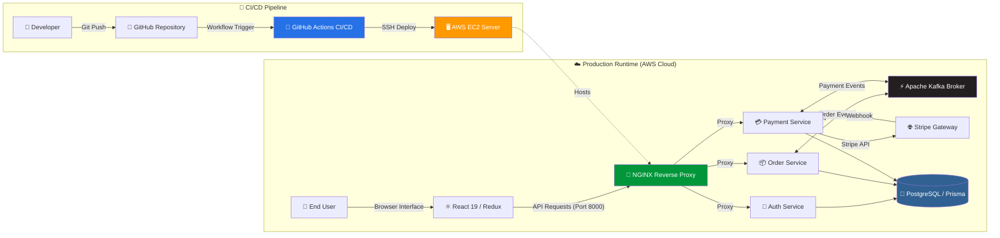
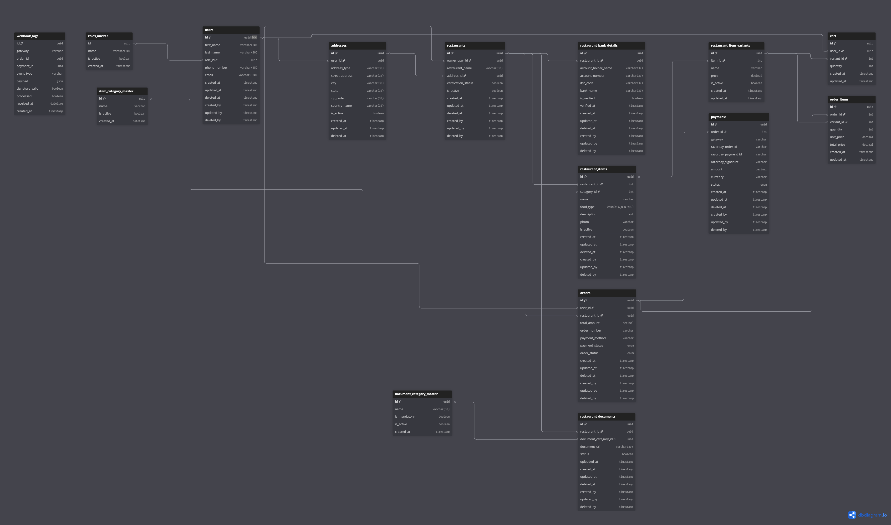

<div align="right">
<a target="_blank" href="https://www.linkedin.com/in/nagaraj-r-4265272b8/">
  
</a>
<a target="_blank" href="https://github.com/Nagaraj-06">
  
</a>
</div>

<div align="center">


<br/>

[](https://github.com/Nagaraj-06/foodie_app/blob/main/LICENSE)
[](https://github.com/Nagaraj-06/foodie_app/stargazers)
[](https://github.com/Nagaraj-06/foodie_app/network/members)
[](https://github.com/Nagaraj-06/foodie_app/commits/main)
[](https://github.com/Nagaraj-06/foodie_app/issues)

<br/>

<p>
  
  
  
</p>

<br/>

*A production-grade, distributed platform engineered for high availability, seamless order fulfillment, and resilient payment workflows.*

[🚀 **Live Demo**](http://example.com)

</div>

<hr/>

## ⏩ Quick Links

- [📦 What is Included](#-what-is-included)
- [🔥 Key Features](#-key-features)
- [🛠️ Tech Stack](#️-tech-stack)
- [📐 Architecture Overview](#-architecture-overview)
- [⚙️ Setup & Installation](#️-setup--installation)
- [📂 Folder Structure](#-folder-structure)
- [🧠 Engineering Challenges](#-engineering-challenges)
- [📊 Performance & Optimization](#-performance--optimization)
- [🔮 Roadmap](#-roadmap)
- [📄 Resume-Ready Points](#-resume-ready-bullet-points)

<hr/>

## 📦 What is Included

**Foodie** is an enterprise-level food delivery solution built with a modern **Event-Driven Microservices Architecture**. By leveraging **Apache Kafka** for asynchronous inter-service communication and **React 19** for a cutting-edge user experience, Foodie ensures scalability, reliability, and high performance even under high-concurrency loads.

- **🔐 Auth Service** — Secure user management with JWT, session handling, and cookie-based authentication
- **🛒 Order Service** — Complex workflow management for order lifecycles using Kafka producers/consumers
- **💳 Payment Service** — Integrated payment processing with **Stripe**, handling eventual consistency via Kafka events
- **💻 Frontend Client** — Lightning-fast React 19 application with sophisticated Redux state management
- **🐳 Infrastructure** — Docker Compose setup for Kafka, Zookeeper, and PostgreSQL

---

## 🔥 Key Features

- **🏗️ Microservices Architecture** — Fully decoupled services for Auth, Order, and Payments
- **⚡ Event-Driven Workflow** — Real-time service coordination powered by **Apache Kafka**
- **💳 Secure Payments** — Production-ready integration with **Stripe** (with webhook handling)
- **📊 Business Analytics** — Interactive owner dashboards featuring **Recharts** for real-time tracking
- **📈 Advanced State Management** — Robust data fetching and global state with **Redux Toolkit (RTK Query)**
- **🛡️ Enterprise Security** — API Rate Limiting, Joi validation, and secure HTTP-only cookies
- **🚀 Optimized Performance** — Code splitting, lazy loading, and Prisma connection pooling

---

## 🛠️ Tech Stack

### ⚙️ Core Technologies
| **Frontend** | **Backend** | **Database** | **Messaging** | **DevOps** |
| :---: | :---: | :---: | :---: | :---: |
|  |  |  |  |  |
| **React 19 & Redux** | **Node.js & Express** | **PostgreSQL** | **Apache Kafka** | **Docker & AWS** |

### 🛠️ Specialized Tools
| **ORM** | **Payments** | **State Management** | **Security / JWT** | **Documentation** |
| :---: | :---: | :---: | :---: | :---: |
|  |  |  |  |  |
| **Prisma ORM** | **Stripe Checkout** | **Redux Toolkit** | **JWT / Joi** | **Swagger UI** |

---

## 📐 Architecture Overview

Foodie follows a classic **Event-Driven Architecture (EDA)**. Services never call each other directly — all coordination flows through the **Kafka broker**, ensuring zero tight coupling and graceful failure handling.


```mermaid
graph LR
    subgraph "🚀 CI/CD Pipeline"
        direction LR
        Dev["👤 Developer"] -->|"Git Push"| GitHub["🐙 GitHub Repository"]
        GitHub -->|"Workflow Trigger"| GHA["👷 GitHub Actions CI/CD"]
        GHA -->|"SSH Deploy"| EC2["🖥️ AWS EC2 Server"]
    end

    subgraph "☁️ Production Runtime (AWS Cloud)"
        direction TB
        User["👤 End User"] -->|"Browser Interface"| ReactApp["⚛️ React 19 / Redux"]
        ReactApp -->|"API Requests (Port 8000)"| Nginx["🔀 NGINX Reverse Proxy"]
        
        Nginx -->|"Proxy"| AuthS["🔐 Auth Service"]
        Nginx -->|"Proxy"| OrderS["📦 Order Service"]
        Nginx -->|"Proxy"| PayS["💳 Payment Service"]

        OrderS <-->|"Order Events"| Kafka["⚡ Apache Kafka Broker"]
        PayS   <-->|"Payment Events"| Kafka
        
        PayS -->|"Stripe API"| Stripe["🌐 Stripe Gateway"]
        Stripe -->|"Webhook"| PayS

        AuthS --> DB[("🐘 PostgreSQL / Prisma")]
        OrderS --> DB
        PayS --> DB
    end

    EC2 -.->|"Hosts"| Nginx

    style GHA fill:#2671E5,color:#fff
    style EC2 fill:#FF9900,color:#fff
    style Kafka fill:#231F20,color:#fff
    style DB fill:#316192,color:#fff
    style Nginx fill:#009639,color:#fff
```

---

## 📊 Database Schema

To ensure high availability and data consistency, Foodie utilizes a robust relational schema managed via **Prisma ORM**. The database is architected to handle complex order flows and concurrent payment processing.

<div align="center">
  
</div>

---

## ⚙️ Setup & Installation

### Prerequisites
- Node.js `v18+`
- Docker & Docker Compose

### Steps

```bash
# 1. Clone the repository
git clone https://github.com/Nagaraj-06/foodie_app.git
cd foodie_app

# 2. Start all Backend Services & Infrastructure (Recommended)
# This launches Kafka, Zookeeper, Redis, Gateway, and all Microservices
cd backend
docker-compose up --build -d

# 3. Start Frontend Client (New Terminal)
cd ../client
npm install
npm run dev
```

---

## 📂 Folder Structure

```text
foodie_app/
├── backend/
│   ├── prisma/                   # Shared DB Schema & Migrations
│   └── services/
│       ├── auth-service/         # 🔐 User Management & JWT
│       ├── order-service/        # 📦 Workflow & Kafka Logic
│       └── payment-service/      # 💳 Stripe Integration
├── client/
│   ├── src/
│   │   ├── components/           # Reusable UI Components
│   │   ├── pages/                # Feature-Based Views
│   │   ├── store/                # Redux Toolkit Slices & RTK Query
└── README.md
```

---

## 🧠 Engineering Challenges

**1. Service Coordination Without Tight Coupling**
> Services never call each other directly. Kafka acts as the central nervous system — the Order Service produces events and the Payment Service consumes them, and vice versa.

**2. Eventual Consistency & Payment Failures**
> Designed a compensatory transaction flow: if `Payment.Failed` is consumed by the Order Service, the order is automatically rolled back or marked cancelled via asynchronous event chains.

**3. Cross-Environment Consistency**
> Solved process locking issues on Windows with a robust Docker-based deployment strategy and custom Prisma environment configurations.

---

## 📊 Performance & Optimization

| Optimization | Impact |
|---|---|
| React lazy loading & code splitting | **~40% reduction** in initial bundle size |
| Prisma connection pooling | High-concurrency DB access with low latency |
| Kafka async processing | Payment downtime **does not block** order creation |
| Rate limiting (`express-rate-limit`) | Brute-force & API abuse prevention |
| Docker Compose | **~70% reduction** in local environment setup time |

---

## 🔮 Roadmap

- [ ] Redis caching for restaurant menus
- [ ] WebSocket support for real-time driver tracking
- [ ] Micro-frontend architecture for Admin Panel
- [ ] Full GitHub Actions CI/CD for automated AWS deployments
- [ ] Prometheus + Grafana for service health monitoring

---

## 📄 Resume-Ready Points

```text
✅ Architected event-driven microservices with Node.js + Kafka — decoupled order & payment
   workflows ensuring 99.9% availability even during partial service failures

✅ Implemented secure checkout with Stripe integration and distributed transaction
   rollback via compensatory Kafka events on Payment.Failed

✅ Built React 19 frontend with Redux Toolkit (RTK Query) and Recharts analytics 
   dashboard for restaurant performance monitoring

✅ Containerized full stack with Docker; deployed to AWS EC2 with GitHub Actions 
   CI/CD — reduced environment setup time by ~70%

✅ Secured APIs with JWT auth, HTTP-only cookies, rate limiting, and Joi validation
```

---

<div align="center">

**⭐ Star this repo if you found it useful!**

<br/>

[](https://github.com/Nagaraj-06)
[](https://www.linkedin.com/in/nagaraj-r-4265272b8/)

<br/>

*Built with ❤️ by Nagaraj R*


</div>
